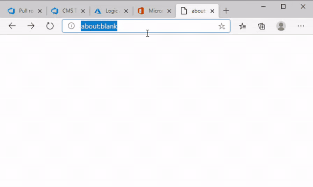

# wasmsdl

Example of how to use C# and SDL in the browser using CoreRT https://github.com/dotnet/corert and WebAssembly.

Set up corert for building WebAssembly https://github.com/dotnet/corert/blob/master/Documentation/how-to-build-WebAssembly.md
Set IlcPath environment variable to whereever corert is cloned:

set IlcPath=e:\github\corert\bin\WebAssembly.wasm.Debug

# Install SDL2 if you want to run the desktop version, not necessary for Wasm as emscripten will download the Wasm port.

# Commands to build mini runtime version

emcc MiniRuntime.wasm.c -c -o MiniRuntime.bc 

dotnet exec "c:\Program Files\dotnet\sdk\5.0.100-preview.7.20366.6\Roslyn\bincore"\csc.dll /O /noconfig /nostdlib /runtimemetadataversion:v4.0.30319 MiniRuntime.cs MiniBCL.cs Program.cs sdl\SDL2.cs /out:wasmsdl.ilexe /langversion:preview /unsafe -define:CODEGEN_WASM MiniRandom.cs

..\corert\bin\WebAssembly.wasm.Debug\tools\ilc --targetarch=wasm wasmsdl.ilexe -o wasmsdl.bc --systemmodule:wasmsdl --Os -g

"E:\GitHub\emsdk\upstream\emscripten\emcc.bat" "wasmsdl.bc" -o "wasmsdl.html" --emrun MiniRuntime.bc -Os -s USE_SDL=2

To run in the browser, start a web server (IIS/IIS Express/server.py etc) at the location of wasmsdl.html
